# ANALYSER DES DONNÉES DES VOITURES

Importation des  bibliothèque et Charger les données depuis un fichier CSV sur une DataFrame 


```python
import pandas as pd
import matplotlib.pyplot as plt
import seaborn as sns
import numpy as np

df=pd.read_csv('../../cleaned_data/cars_data_cleaned.csv')
```

Statistiques descriptives numériques :


```python
df.describe(include='all')
```


<div>
<style scoped>
    .dataframe tbody tr th:only-of-type {
        vertical-align: middle;
    }

    .dataframe tbody tr th {
        vertical-align: top;
    }

    .dataframe thead th {
        text-align: right;
    }
</style>
<table border="1" class="dataframe">
  <thead>
    <tr style="text-align: right;">
      <th></th>
      <th>marque</th>
      <th>modele</th>
      <th>annee-modele</th>
      <th>kilometrage</th>
      <th>type_de_carburant</th>
      <th>puissance_fiscale</th>
      <th>boite_de_vitesses</th>
      <th>nombre_de_portes</th>
      <th>origine</th>
      <th>premiere_main</th>
      <th>etat</th>
      <th>airbags</th>
      <th>climatisation</th>
      <th>abs</th>
      <th>esp</th>
      <th>cd/mp3/bluetooth</th>
      <th>prix</th>
    </tr>
  </thead>
  <tbody>
    <tr>
      <th>count</th>
      <td>22952</td>
      <td>22952</td>
      <td>22952.000000</td>
      <td>22952.000000</td>
      <td>22952</td>
      <td>22952.000000</td>
      <td>22952</td>
      <td>22952.000000</td>
      <td>22952</td>
      <td>22952.000000</td>
      <td>22952</td>
      <td>22952.000000</td>
      <td>22952.000000</td>
      <td>22952.000000</td>
      <td>22952.000000</td>
      <td>22952.000000</td>
      <td>22952.000000</td>
    </tr>
    <tr>
      <th>unique</th>
      <td>23</td>
      <td>335</td>
      <td>NaN</td>
      <td>NaN</td>
      <td>4</td>
      <td>NaN</td>
      <td>2</td>
      <td>NaN</td>
      <td>4</td>
      <td>NaN</td>
      <td>6</td>
      <td>NaN</td>
      <td>NaN</td>
      <td>NaN</td>
      <td>NaN</td>
      <td>NaN</td>
      <td>NaN</td>
    </tr>
    <tr>
      <th>top</th>
      <td>renault</td>
      <td>kangoo</td>
      <td>NaN</td>
      <td>NaN</td>
      <td>diesel</td>
      <td>NaN</td>
      <td>manuelle</td>
      <td>NaN</td>
      <td>ww au maroc</td>
      <td>NaN</td>
      <td>excellent</td>
      <td>NaN</td>
      <td>NaN</td>
      <td>NaN</td>
      <td>NaN</td>
      <td>NaN</td>
      <td>NaN</td>
    </tr>
    <tr>
      <th>freq</th>
      <td>3322</td>
      <td>1201</td>
      <td>NaN</td>
      <td>NaN</td>
      <td>20905</td>
      <td>NaN</td>
      <td>19690</td>
      <td>NaN</td>
      <td>18606</td>
      <td>NaN</td>
      <td>13957</td>
      <td>NaN</td>
      <td>NaN</td>
      <td>NaN</td>
      <td>NaN</td>
      <td>NaN</td>
      <td>NaN</td>
    </tr>
    <tr>
      <th>mean</th>
      <td>NaN</td>
      <td>NaN</td>
      <td>2011.561476</td>
      <td>135529.583479</td>
      <td>NaN</td>
      <td>7.098074</td>
      <td>NaN</td>
      <td>4.920181</td>
      <td>NaN</td>
      <td>0.260021</td>
      <td>NaN</td>
      <td>0.568883</td>
      <td>0.594676</td>
      <td>0.526316</td>
      <td>0.356178</td>
      <td>0.519606</td>
      <td>107016.116635</td>
    </tr>
    <tr>
      <th>std</th>
      <td>NaN</td>
      <td>NaN</td>
      <td>5.411051</td>
      <td>90275.947855</td>
      <td>NaN</td>
      <td>1.522438</td>
      <td>NaN</td>
      <td>0.391501</td>
      <td>NaN</td>
      <td>0.438655</td>
      <td>NaN</td>
      <td>0.495243</td>
      <td>0.490965</td>
      <td>0.499318</td>
      <td>0.478879</td>
      <td>0.499626</td>
      <td>39937.175889</td>
    </tr>
    <tr>
      <th>min</th>
      <td>NaN</td>
      <td>NaN</td>
      <td>1990.000000</td>
      <td>2500.000000</td>
      <td>NaN</td>
      <td>5.000000</td>
      <td>NaN</td>
      <td>3.000000</td>
      <td>NaN</td>
      <td>0.000000</td>
      <td>NaN</td>
      <td>0.000000</td>
      <td>0.000000</td>
      <td>0.000000</td>
      <td>0.000000</td>
      <td>0.000000</td>
      <td>60000.000000</td>
    </tr>
    <tr>
      <th>25%</th>
      <td>NaN</td>
      <td>NaN</td>
      <td>2008.000000</td>
      <td>62500.000000</td>
      <td>NaN</td>
      <td>6.000000</td>
      <td>NaN</td>
      <td>5.000000</td>
      <td>NaN</td>
      <td>0.000000</td>
      <td>NaN</td>
      <td>0.000000</td>
      <td>0.000000</td>
      <td>0.000000</td>
      <td>0.000000</td>
      <td>0.000000</td>
      <td>75000.000000</td>
    </tr>
    <tr>
      <th>50%</th>
      <td>NaN</td>
      <td>NaN</td>
      <td>2012.000000</td>
      <td>135000.000000</td>
      <td>NaN</td>
      <td>6.000000</td>
      <td>NaN</td>
      <td>5.000000</td>
      <td>NaN</td>
      <td>0.000000</td>
      <td>NaN</td>
      <td>1.000000</td>
      <td>1.000000</td>
      <td>1.000000</td>
      <td>0.000000</td>
      <td>1.000000</td>
      <td>97000.000000</td>
    </tr>
    <tr>
      <th>75%</th>
      <td>NaN</td>
      <td>NaN</td>
      <td>2016.000000</td>
      <td>195000.000000</td>
      <td>NaN</td>
      <td>8.000000</td>
      <td>NaN</td>
      <td>5.000000</td>
      <td>NaN</td>
      <td>1.000000</td>
      <td>NaN</td>
      <td>1.000000</td>
      <td>1.000000</td>
      <td>1.000000</td>
      <td>1.000000</td>
      <td>1.000000</td>
      <td>128000.000000</td>
    </tr>
    <tr>
      <th>max</th>
      <td>NaN</td>
      <td>NaN</td>
      <td>2022.000000</td>
      <td>475000.000000</td>
      <td>NaN</td>
      <td>14.000000</td>
      <td>NaN</td>
      <td>5.000000</td>
      <td>NaN</td>
      <td>1.000000</td>
      <td>NaN</td>
      <td>1.000000</td>
      <td>1.000000</td>
      <td>1.000000</td>
      <td>1.000000</td>
      <td>1.000000</td>
      <td>237000.000000</td>
    </tr>
  </tbody>
</table>
</div>


Statistiques descriptives pour les colonnes catégoriques :


```python
df.describe(include=['object'])
```


<div>
<style scoped>
    .dataframe tbody tr th:only-of-type {
        vertical-align: middle;
    }

    .dataframe tbody tr th {
        vertical-align: top;
    }

    .dataframe thead th {
        text-align: right;
    }
</style>
<table border="1" class="dataframe">
  <thead>
    <tr style="text-align: right;">
      <th></th>
      <th>marque</th>
      <th>modele</th>
      <th>type_de_carburant</th>
      <th>boite_de_vitesses</th>
      <th>origine</th>
      <th>etat</th>
    </tr>
  </thead>
  <tbody>
    <tr>
      <th>count</th>
      <td>22952</td>
      <td>22952</td>
      <td>22952</td>
      <td>22952</td>
      <td>22952</td>
      <td>22952</td>
    </tr>
    <tr>
      <th>unique</th>
      <td>23</td>
      <td>335</td>
      <td>4</td>
      <td>2</td>
      <td>4</td>
      <td>6</td>
    </tr>
    <tr>
      <th>top</th>
      <td>renault</td>
      <td>kangoo</td>
      <td>diesel</td>
      <td>manuelle</td>
      <td>ww au maroc</td>
      <td>excellent</td>
    </tr>
    <tr>
      <th>freq</th>
      <td>3322</td>
      <td>1201</td>
      <td>20905</td>
      <td>19690</td>
      <td>18606</td>
      <td>13957</td>
    </tr>
  </tbody>
</table>
</div>


Valeurs manquantes (totales et pourcentages) :


```python
missing_values = df.isnull().sum()
missing_percent = (missing_values / len(df)) * 100
missing_summary = pd.DataFrame({
    "Valeurs Manquantes": missing_values,
    "Pourcentage (%)": missing_percent
})
print(missing_summary)
```

                       Valeurs Manquantes  Pourcentage (%)
    marque                              0              0.0
    modele                              0              0.0
    annee-modele                        0              0.0
    kilometrage                         0              0.0
    type_de_carburant                   0              0.0
    puissance_fiscale                   0              0.0
    boite_de_vitesses                   0              0.0
    nombre_de_portes                    0              0.0
    origine                             0              0.0
    premiere_main                       0              0.0
    etat                                0              0.0
    airbags                             0              0.0
    climatisation                       0              0.0
    abs                                 0              0.0
    esp                                 0              0.0
    cd/mp3/bluetooth                    0              0.0
    prix                                0              0.0
    

Distribution des données catégoriques :


```python
for col in df.select_dtypes(include=['object']).columns:
    print(f"\nDistribution pour {col} :")
    print(df[col].value_counts())
```

    
    Distribution pour marque :
    marque
    renault          3322
    volkswagen       3123
    dacia            2979
    peugeot          1923
    mercedes-benz    1604
    ford             1587
    hyundai          1530
    citroen          1150
    fiat             1052
    toyota            878
    opel              584
    nissan            517
    audi              469
    kia               461
    bmw               432
    skoda             353
    seat              318
    jeep              148
    land rover        144
    alfa romeo        118
    mini               88
    chevrolet          88
    suzuki             84
    Name: count, dtype: int64
    
    Distribution pour modele :
    modele
    kangoo    1201
    logan     1116
    clio       843
    dokker     675
    220        612
              ... 
    s3           3
    azera        3
    306          3
    16           3
    507          3
    Name: count, Length: 335, dtype: int64
    
    Distribution pour type_de_carburant :
    type_de_carburant
    diesel        20905
    essence        2020
    hybride          15
    electrique       12
    Name: count, dtype: int64
    
    Distribution pour boite_de_vitesses :
    boite_de_vitesses
    manuelle       19690
    automatique     3262
    Name: count, dtype: int64
    
    Distribution pour origine :
    origine
    ww au maroc             18606
    dedouanee                3523
    importee neuve            763
    pas encore dedouanee       60
    Name: count, dtype: int64
    
    Distribution pour etat :
    etat
    excellent      13957
    tres bon        7099
    bon             1803
    correct           81
    pour pieces        9
    endommage          3
    Name: count, dtype: int64
    

Analyse des valeurs aberrantes :


```python
for col in df.select_dtypes(include=['int64', 'float64']).columns:
    q1 = df[col].quantile(0.25)
    q3 = df[col].quantile(0.75)
    iqr = q3 - q1
    lower_bound = q1 - 1.5 * iqr
    upper_bound = q3 + 1.5 * iqr
    outliers = df[(df[col] < lower_bound) | (df[col] > upper_bound)]
    print(f"{col} : {len(outliers)} valeurs aberrantes détectées.")
```

    annee-modele : 251 valeurs aberrantes détectées.
    kilometrage : 190 valeurs aberrantes détectées.
    puissance_fiscale : 630 valeurs aberrantes détectées.
    nombre_de_portes : 916 valeurs aberrantes détectées.
    premiere_main : 0 valeurs aberrantes détectées.
    airbags : 0 valeurs aberrantes détectées.
    climatisation : 0 valeurs aberrantes détectées.
    abs : 0 valeurs aberrantes détectées.
    esp : 0 valeurs aberrantes détectées.
    cd/mp3/bluetooth : 0 valeurs aberrantes détectées.
    prix : 639 valeurs aberrantes détectées.
    

histograme de la Distribution du Prix


```python
sns.set_theme(style="whitegrid")

# 1. Price Distribution
plt.figure(figsize=(8, 6))
sns.histplot(df['prix'], kde=True, bins=50)
plt.title("Distribution des prix")
plt.xlabel("Prix")
plt.ylabel("Fréquence")
plt.show()
```


    
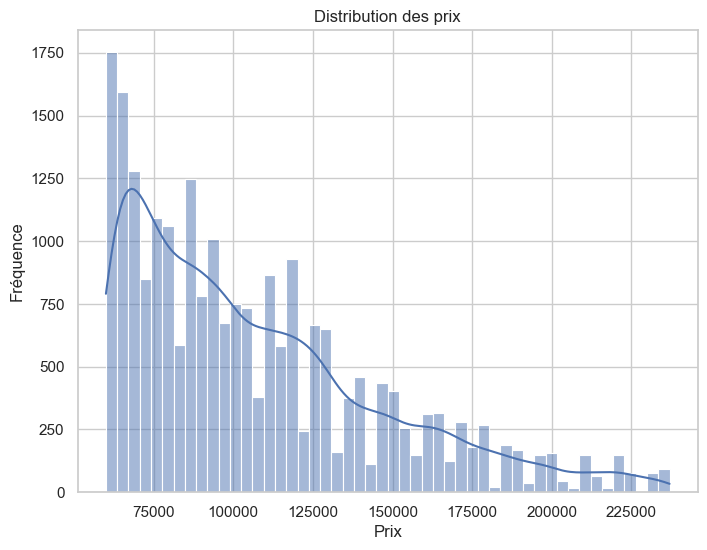
    


Relation entre le kilométrage et le prix moyen


```python
moyennes = df.groupby('kilometrage')['prix'].mean().reset_index()

# Tracer les données regroupées
plt.figure(figsize=(10, 6))
plt.plot(moyennes['kilometrage'], moyennes['prix'], marker='o', color='green')
plt.title('Kilométrage vs Prix (moyennes)', fontsize=16)
plt.xlabel('Kilométrage (groupé)')
plt.ylabel('Prix (moyenne)')
plt.show()

```


    
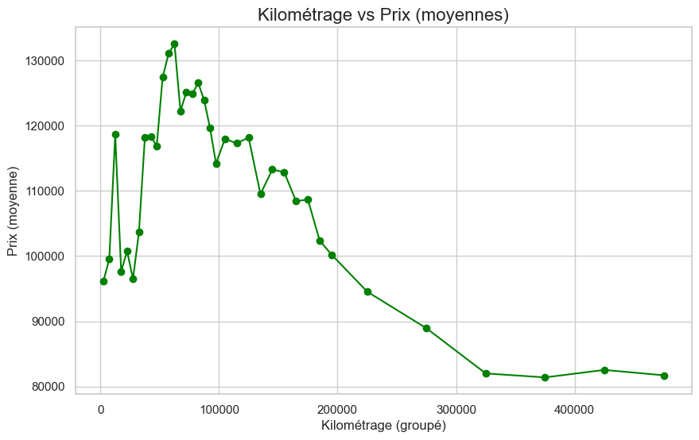
    


Distribution du Prix par Année de Modèle


```python
plt.figure(figsize=(15, 10))
sns.boxplot(x=df['annee-modele'], y=df['prix'])
plt.title('Année-Modele vs Prix', fontsize=16)
plt.xticks(rotation=45)
plt.xlabel('Année-Modele')
plt.ylabel('Prix')
plt.show()

```


    
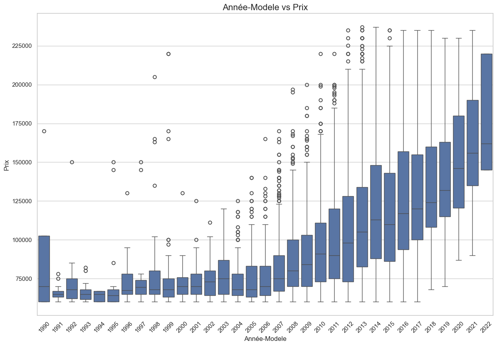
    


Top 10 des Marques par Nombre de Véhicules


```python
plt.figure(figsize=(14, 8))
top_brands = df['marque'].value_counts().head(10)
sns.barplot(x=top_brands.index, y=top_brands.values, palette="viridis")
plt.title('Top 10 des Marques par Nombre de Véhicules', fontsize=16)
plt.xlabel('Marque')
plt.ylabel('Count')
plt.show()
```

    C:\Users\HP\AppData\Local\Temp\ipykernel_22728\793698646.py:3: FutureWarning: 
    
    Passing `palette` without assigning `hue` is deprecated and will be removed in v0.14.0. Assign the `x` variable to `hue` and set `legend=False` for the same effect.
    
      sns.barplot(x=top_brands.index, y=top_brands.values, palette="viridis")
    


    
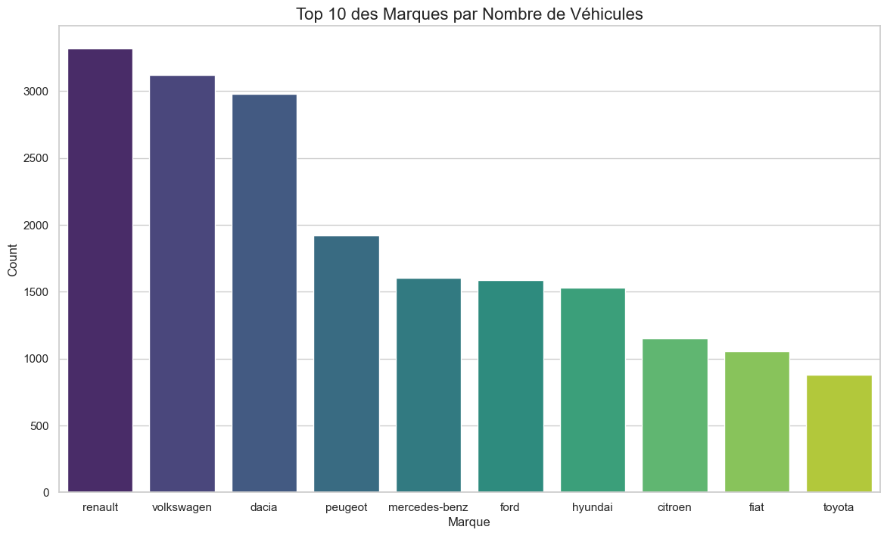
    


Distribution des Prix selon le Type de Carburant


```python
plt.figure(figsize=(10, 6))
sns.boxplot(x=df['type_de_carburant'], y=df['prix'], palette="muted")
plt.title('Distribution des Prix selon le Type de Carburant', fontsize=16)
plt.xlabel('Type de Carburant')
plt.ylabel('Prix')
plt.show()
```

    C:\Users\HP\AppData\Local\Temp\ipykernel_22728\1591795793.py:2: FutureWarning: 
    
    Passing `palette` without assigning `hue` is deprecated and will be removed in v0.14.0. Assign the `x` variable to `hue` and set `legend=False` for the same effect.
    
      sns.boxplot(x=df['type_de_carburant'], y=df['prix'], palette="muted")
    


    
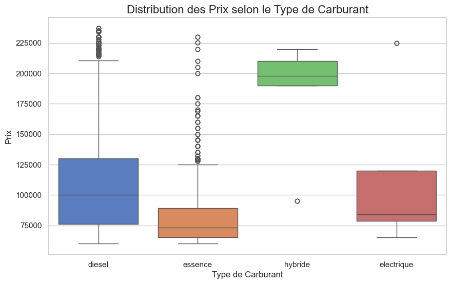
    


Répartition des Voitures par Type de Carburant


```python
# Group by Type de carburant and calculate the counts
fuel_type_counts = df['type_de_carburant'].value_counts()

# Create a pie chart
plt.figure(figsize=(8, 8))
plt.pie(
    fuel_type_counts.values, 
    labels=fuel_type_counts.index, 
    autopct='%1.1f%%', 
    startangle=90, 
    colors=sns.color_palette("pastel")
)
plt.title('Répartition des Voitures par Type de Carburant', fontsize=16)
plt.show()
```


    
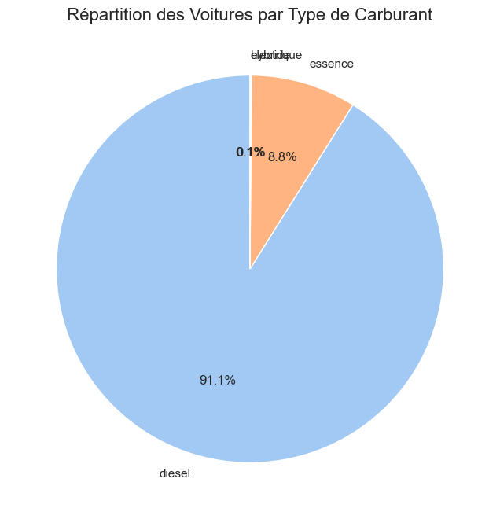
    


Répartition des Voitures par Origine


```python
# Group by Origine and calculate the counts
origine_counts = df['origine'].value_counts()

# Create a pie chart
plt.figure(figsize=(8, 8))
wedges, texts, autotexts =plt.pie(
    origine_counts.values, 
    labels=origine_counts.index, 
    autopct='%1.1f%%', 
    startangle=90, 
    colors=sns.color_palette("pastel")
)

for text in texts:
    text.set_rotation(45)
    
plt.title('Répartition des Voitures par Origine', fontsize=16)
plt.show()
```


    
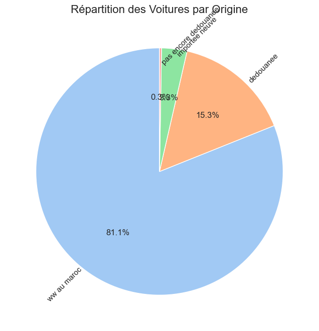
    


Carte de Corrélation des Caractéristiques Numériques


```python
plt.figure(figsize=(10, 8))
numerical_features = ['prix', 'kilometrage', 'puissance_fiscale', 'annee-modele']
correlation_matrix = df[numerical_features].corr()
sns.heatmap(correlation_matrix, annot=True, cmap='coolwarm', fmt='.2f')
plt.title('Carte de Corrélation des Caractéristiques Numériques', fontsize=16)
plt.show()

```


    
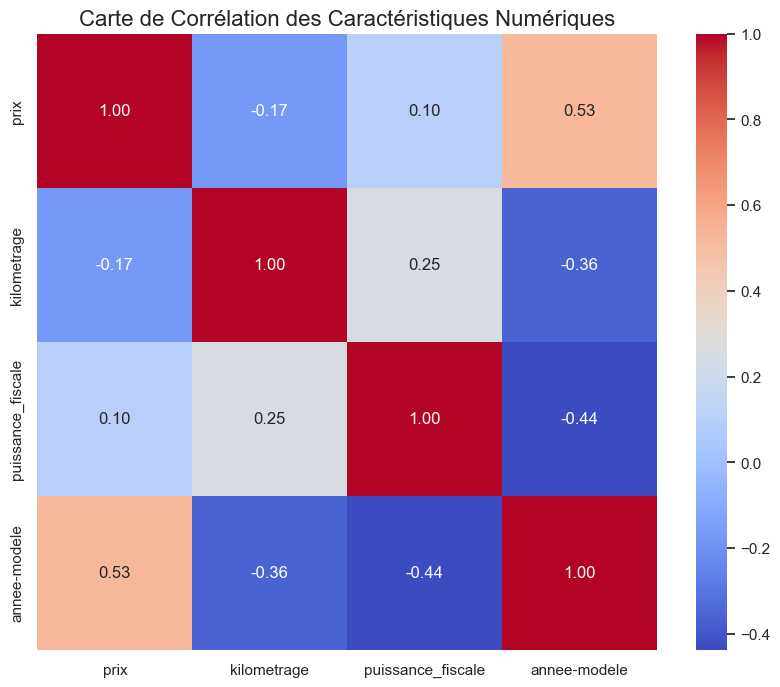
    


Distribution des Prix selon la Boîte de Vitesses


```python
plt.figure(figsize=(10, 6))
sns.boxplot(x=df['boite_de_vitesses'], y=df['prix'], palette='muted')
plt.title('Distribution des Prix selon la Boîte de Vitesses', fontsize=16)
plt.xlabel('Boite de Vitesses')
plt.ylabel('Prix')
plt.show()

```

    C:\Users\HP\AppData\Local\Temp\ipykernel_22728\2003698813.py:2: FutureWarning: 
    
    Passing `palette` without assigning `hue` is deprecated and will be removed in v0.14.0. Assign the `x` variable to `hue` and set `legend=False` for the same effect.
    
      sns.boxplot(x=df['boite_de_vitesses'], y=df['prix'], palette='muted')
    


    
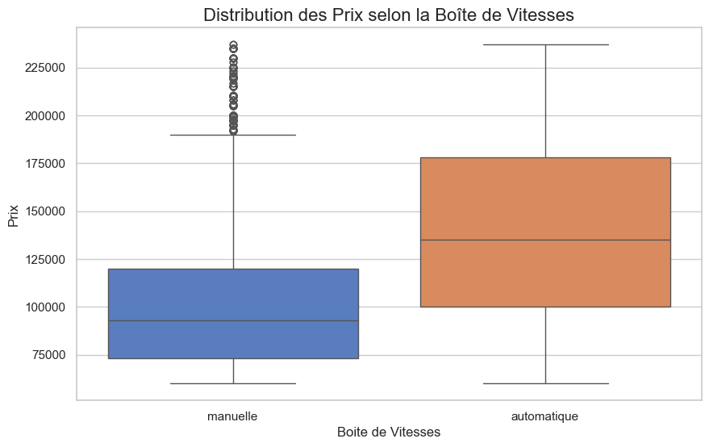
    


Prix Moyen par les 10 Principales Marques


```python
top_brands_avg_price = df.groupby('marque')['prix'].mean().nlargest(10)
plt.figure(figsize=(12, 6))
sns.barplot(x=top_brands_avg_price.index, y=top_brands_avg_price.values, palette='viridis')
plt.title('Prix Moyen par les 10 Principales Marques', fontsize=16)
plt.xlabel('Marque')
plt.ylabel('Average Prix')
plt.xticks(rotation=45)
plt.show()

```

    C:\Users\HP\AppData\Local\Temp\ipykernel_22728\1124787929.py:3: FutureWarning: 
    
    Passing `palette` without assigning `hue` is deprecated and will be removed in v0.14.0. Assign the `x` variable to `hue` and set `legend=False` for the same effect.
    
      sns.barplot(x=top_brands_avg_price.index, y=top_brands_avg_price.values, palette='viridis')
    


    
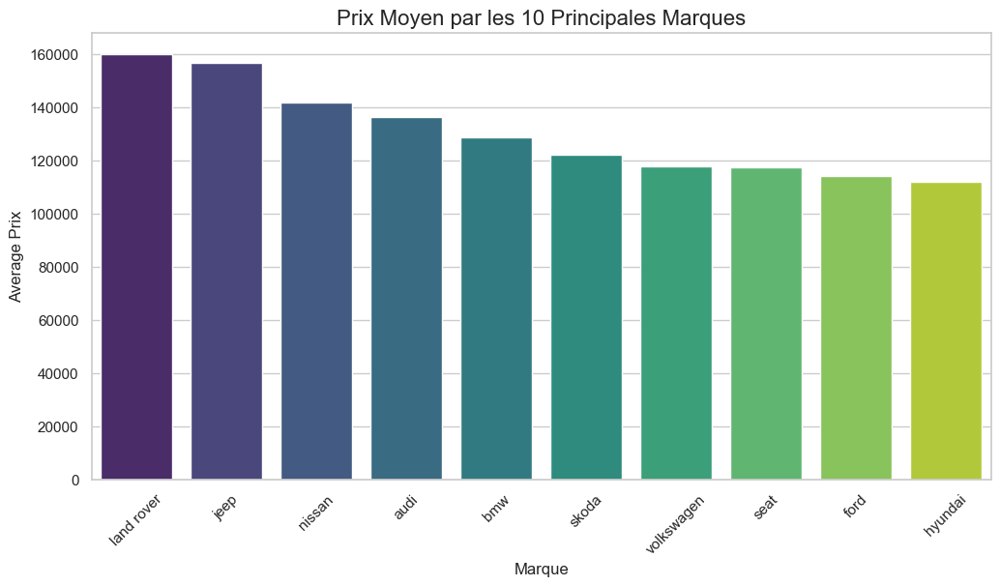
    


Voir les statistiques de la DataFrame


```python
# Display descriptive statistics for numerical features
df.describe()
```


<div>
<style scoped>
    .dataframe tbody tr th:only-of-type {
        vertical-align: middle;
    }

    .dataframe tbody tr th {
        vertical-align: top;
    }

    .dataframe thead th {
        text-align: right;
    }
</style>
<table border="1" class="dataframe">
  <thead>
    <tr style="text-align: right;">
      <th></th>
      <th>annee-modele</th>
      <th>kilometrage</th>
      <th>puissance_fiscale</th>
      <th>nombre_de_portes</th>
      <th>premiere_main</th>
      <th>airbags</th>
      <th>climatisation</th>
      <th>abs</th>
      <th>esp</th>
      <th>cd/mp3/bluetooth</th>
      <th>prix</th>
    </tr>
  </thead>
  <tbody>
    <tr>
      <th>count</th>
      <td>22952.000000</td>
      <td>22952.000000</td>
      <td>22952.000000</td>
      <td>22952.000000</td>
      <td>22952.000000</td>
      <td>22952.000000</td>
      <td>22952.000000</td>
      <td>22952.000000</td>
      <td>22952.000000</td>
      <td>22952.000000</td>
      <td>22952.000000</td>
    </tr>
    <tr>
      <th>mean</th>
      <td>2011.561476</td>
      <td>135529.583479</td>
      <td>7.098074</td>
      <td>4.920181</td>
      <td>0.260021</td>
      <td>0.568883</td>
      <td>0.594676</td>
      <td>0.526316</td>
      <td>0.356178</td>
      <td>0.519606</td>
      <td>107016.116635</td>
    </tr>
    <tr>
      <th>std</th>
      <td>5.411051</td>
      <td>90275.947855</td>
      <td>1.522438</td>
      <td>0.391501</td>
      <td>0.438655</td>
      <td>0.495243</td>
      <td>0.490965</td>
      <td>0.499318</td>
      <td>0.478879</td>
      <td>0.499626</td>
      <td>39937.175889</td>
    </tr>
    <tr>
      <th>min</th>
      <td>1990.000000</td>
      <td>2500.000000</td>
      <td>5.000000</td>
      <td>3.000000</td>
      <td>0.000000</td>
      <td>0.000000</td>
      <td>0.000000</td>
      <td>0.000000</td>
      <td>0.000000</td>
      <td>0.000000</td>
      <td>60000.000000</td>
    </tr>
    <tr>
      <th>25%</th>
      <td>2008.000000</td>
      <td>62500.000000</td>
      <td>6.000000</td>
      <td>5.000000</td>
      <td>0.000000</td>
      <td>0.000000</td>
      <td>0.000000</td>
      <td>0.000000</td>
      <td>0.000000</td>
      <td>0.000000</td>
      <td>75000.000000</td>
    </tr>
    <tr>
      <th>50%</th>
      <td>2012.000000</td>
      <td>135000.000000</td>
      <td>6.000000</td>
      <td>5.000000</td>
      <td>0.000000</td>
      <td>1.000000</td>
      <td>1.000000</td>
      <td>1.000000</td>
      <td>0.000000</td>
      <td>1.000000</td>
      <td>97000.000000</td>
    </tr>
    <tr>
      <th>75%</th>
      <td>2016.000000</td>
      <td>195000.000000</td>
      <td>8.000000</td>
      <td>5.000000</td>
      <td>1.000000</td>
      <td>1.000000</td>
      <td>1.000000</td>
      <td>1.000000</td>
      <td>1.000000</td>
      <td>1.000000</td>
      <td>128000.000000</td>
    </tr>
    <tr>
      <th>max</th>
      <td>2022.000000</td>
      <td>475000.000000</td>
      <td>14.000000</td>
      <td>5.000000</td>
      <td>1.000000</td>
      <td>1.000000</td>
      <td>1.000000</td>
      <td>1.000000</td>
      <td>1.000000</td>
      <td>1.000000</td>
      <td>237000.000000</td>
    </tr>
  </tbody>
</table>
</div>


Détection des Valeurs Abérantes pour le Prix


```python
plt.figure(figsize=(10, 6))
sns.boxplot(x=df['prix'])
plt.title('Détection des Valeurs Abérantes pour le Prix', fontsize=16)
plt.xlabel('Prix')
plt.show()

```


    
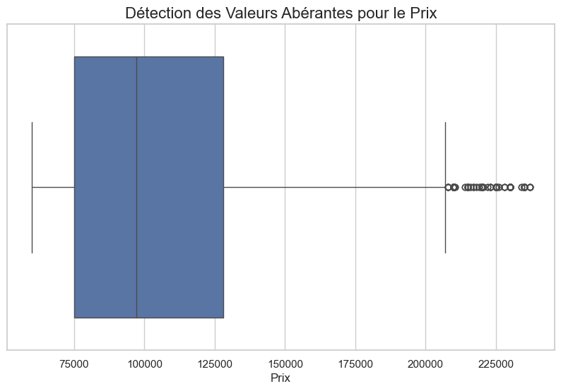
    


Répartition des Véhicules par État


```python
plt.figure(figsize=(10, 6))
sns.countplot(data=df, x='etat')
plt.title('Répartition des Véhicules par État', fontsize=16)
plt.xlabel('État')
plt.ylabel('Nombre de Véhicules')
plt.show()

```


    
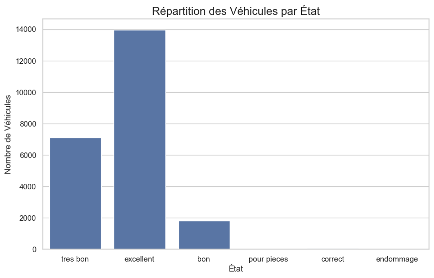
    

